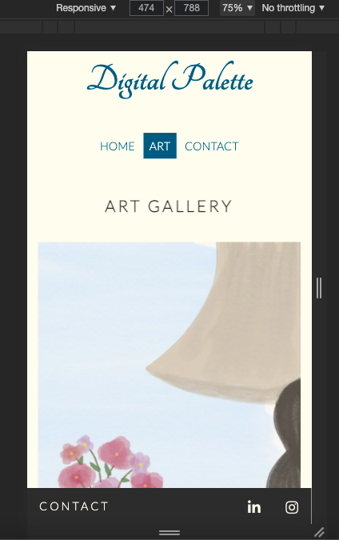

# Digital Palette

[Digital Palette](https://mervekucukzoroglu.github.io/digital-palette/) is a digital art gallery of Merve Kucukzoroglu. Palette, brushes and colours are treasures of an artist. It is all about rythm and harmony of colors. 

In this page you will find my digital paintings and digital sketches. This site hopes to inspire young artists and art lovers. The site targets digital artists, to collaborate and to expand network. The site provides opportunity to contact with filling out the form or by directly contacting though the social media links provided in the footer. 

# Features
This site is designed for interests of digital artists. To maintain their interest the site is responsive.

## Existing Features
<ul> 
    <li>
        <h3><u>Header</u></h3>
        <ul>
            <li>Logo</li>
            
Featured on all the pages with a hyperlink to home page

            <li>Navigation Bar</li>
            
Featured on all the pages with a responsive design and functionality. Navigation bar includes links to Home, Art, and Contact pages. It is user-friendly and allows the user to navigate among pages easily without the need for using back button. It also highlights the page name user is on.

        </ul>
    </li>
    
    <li>
    <h3><u>Circle Image - Home Page</u></h3>
    
Circular digital-painting of a girl dancing under the moonlight that looks like a palette. The image depicts the emotion of an artist while holding a brush and painting. The image matches with the color-code of the page, hence takes the attention of audience.

    </li>
    
    <li>
    <h3><u>Welcome Section - Home page</u></h3>
    
This section welcomes the user and provides a palette icon that is linked to the art page of the site. When the mouse hovers on the icon, the icon color changes to the same blue tone used in the site and the size increases.

    </li>
    
    <li>
    <h3><u>Footer</u></h3>
    
Featured on all the pages. On left are the LinedIn and Instagram icons that links to my social media accounts. On the right side is a link for Contact page. The footer is fixed to the bottom of screen. 

    </li>
    
    <li>
    <h3><u>Art Page</u></h3>
    
This page provides the user with digital art paintings and sketches. The art is copyrighted to Merve Kucukzoroglu. However, it can inspire the user and the user can contact for permission to use for any art.

    </li>
    
    <li>
    <h3><u>Contact Page</u></h3>
    
Contact Page provides with responsive contact form. The user needs to enter all the fields in order to send the message. First name, Last name, email address and message are input fields. When the mouse hovers on the fields the border color changes. The send button inverts the text and background color when the mouse hovers on it. 

    </li>
    
</ul>

## Future Features
<ul>
<li>Shopping cart and order feature.</li>
<li>Synchronized section for my instagram page that shows the art posts, stories and highlights in real time.</li>
</ul>

# Testing
<ul>
<li>Each code and feature is tested with DevTools while coding the website at the same time.</li>
<li>The links are tested and works corretly as expected.</li>
<li>The color coding is tested with 'Contrast Grid'.</li>

<li>All the pages are responsive to all the screen sizes.</li>
<li>The art gallery is designed with flex and has responsive columns with 'wrap' property for different screen sizes.
<li>The medium to larger screen sizes have two columns of images. </li>

<li>The larger screen sizes have more columns based on the width of screen.</li> 

<li>The smaller screen sizes, such as mobile, have one column of image.</li>

<li>The navigation bar menu exchanges text and background color accordingly when the mouse hovers on it.</li>
</ul>

# Validator Testing
<ul>
<li>HTML
<ul><li>No errors found when testing through the official <a href="https://validator.w3.org/">W3C validator</a></li></ul>
</li>
<li>CSS
<ul><li>No errors found when testing through the official <a href="https://jigsaw.w3.org/css-validator/">(Jigsaw) CSS validator</a></li></ul>
</li>
</ul>

# Deployment
<ul>
<li>The site was deployed to Github pages. The steps for deployment are as follows:
    <ul>
        <li>In Github repository, navigate to the Settings tab </li>
        <li>Find the 'pages section' in the settings page</li>
        <li>From the source section drop-down menu, select the Main Branch</li>
        <li>Click save and the page will be refreshed automatically and the site is deployed.</li>
        <li>My site was successfully deployed.</li>
        <li><a href="https://mervekucukzoroglu.github.io/digital-palette/">Click here</a> for visiting my deployed site.</li>
    </ul>
</li>
</ul>

# Credits
### Media
<ul>
<li>All the images, digital arts are credited and copyrighted to Merve Kucukzoroglu.</li>
</ul>

### Code
<ul>
<li>Font Awesome icons and their code - i class="fas fa-palette" - is credited to <a href="https://fontawesome.com/">Font Awesome page</a>. The icons used are: Palette in home page and social media icons in the footer.</li>
<li>The script code for font awesome icons - script src="https://kit.fontawesome.com/e6e69ae431.js" crossorigin="anonymous" - is credited to <a href="https://github.com/Code-Institute-Solutions/love-running-2.0-sourcecode/tree/main/04-creating-the-club-ethos/05-club-ethos-icons">Love Running project of Code Institute</a></li>
<li>I learned Flex coding for my gallery page with practicing the <a href="https://flexboxfroggy.com"> Flexbox Froggy game</a></li>
<li>Google fonts Tangerine and Lato are used for this site. The <a href="https://fonts.googleapis.com/css2?family=Lato:wght@300&family=Tangerine:wght@700&display=swap">code url </a>is imported from google fonts </li>
</ul>

### Ideas
<ul>
<li>The circular image in the home page idea occured to me from <a href="https://github.com/Code-Institute-Solutions/love-running-2.0-sourcecode/tree/main/04-creating-the-club-ethos/04-club-ethos-center-content">Love Running Club Ethos central image, Code Institute.</a> I have used one of my paintings as the background image for the circular image. I have also rearranged the styling and sizes according to my site needs.</li>
</ul>

